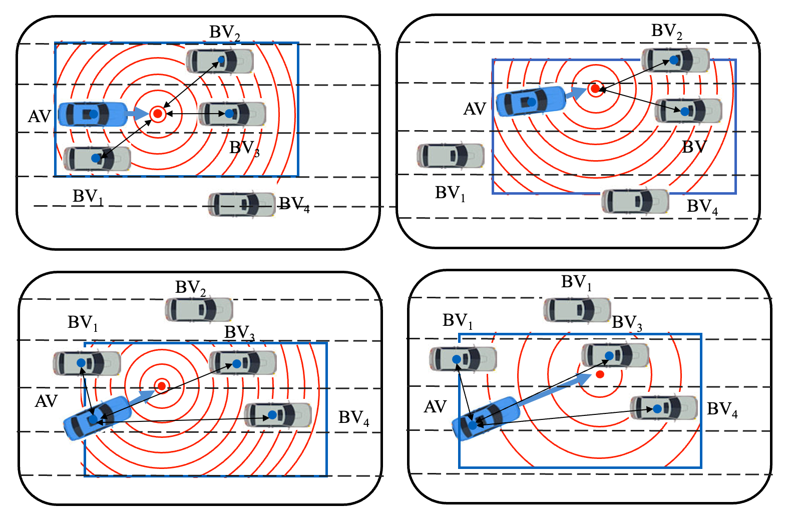

---
title: "Risk-Guided Adversarial Policy Optimization"
permalink: /research/RAPO/
layout: post
author_profile: true
---

# Risk-Guided Adversarial Policy Optimization

**Date:** 2022.9-2023.9  
**Location:** Tongji University

## Overview
We proposed a risk-guided adversarial policy optimization method for safety-critical scenario generation, which generates more diverse and plausible scenarios more efficiently.

## Details
- **Objective:** To develop a method that improves the generation of diverse and plausible safety-critical scenarios.
- **Methodology:** Utilized risk-guided sampling and adversarial reinforcement learning techniques.
- **Results:** Achieved higher diversity and plausibility in scenario generation, contributing to more robust testing of autonomous driving systems.
- **Applications:** This method can be applied in various autonomous driving simulation environments to enhance safety and reliability.

## Publications
- [Link to Publication 1](#)
- [Link to Publication 2](#)

## Team
- **Lead Researcher:** Prof. Yanjun Huang
- **Team Members:** 
  - Member 1
  - Member 2
